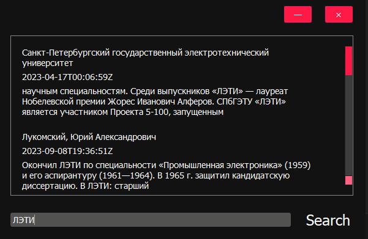

#   WikiFastFinder 
Программа для поиска в Википедии.

Написана с использованием PyQt5. 
Поддерживает навигацию с помошью клавиш:

* Enter - отправка запросса 
* Tab - изменение фокуса на элементах
* Esc - закртие приложение

В программе обрабатываются "странные" и пустые запросы:

А также реализуется percent encoding:

Проект реализован в рамках выполнения первой лабораторной работы по курсу Kotlin (типа).

ЛЭТИ 5 семестр.